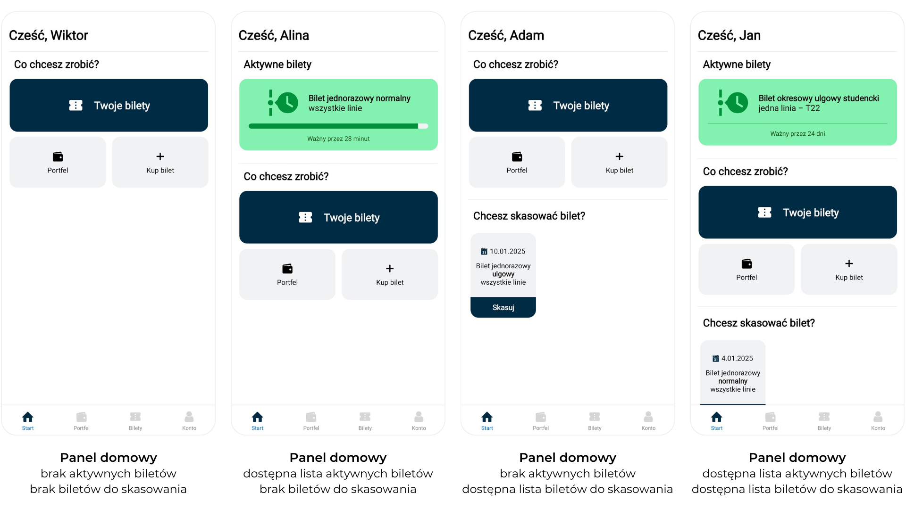
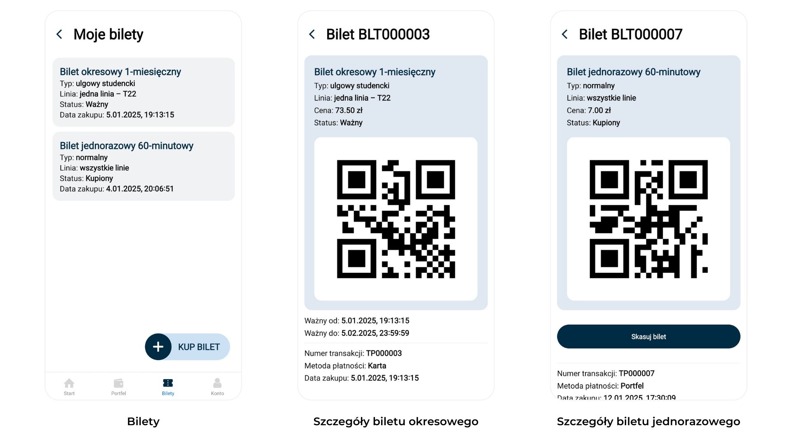
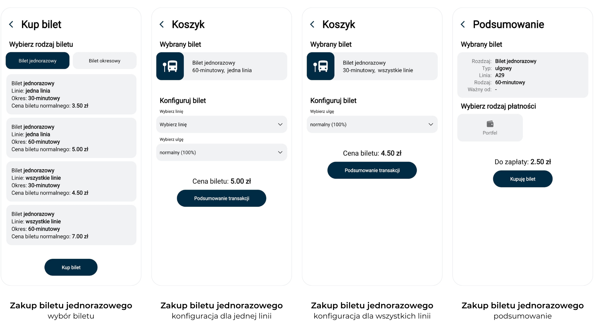
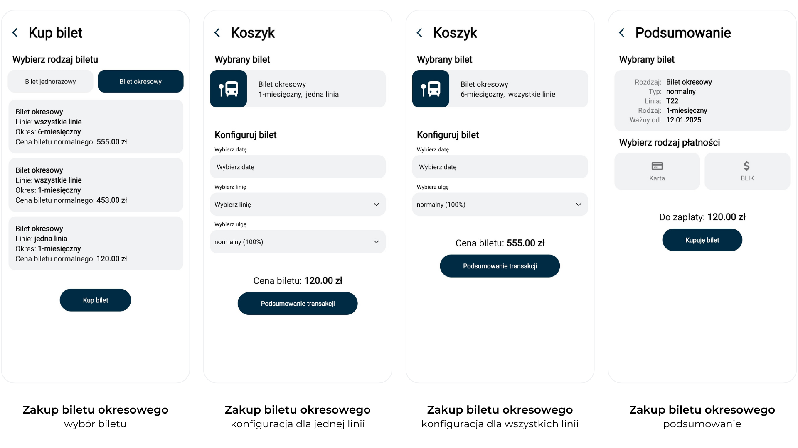
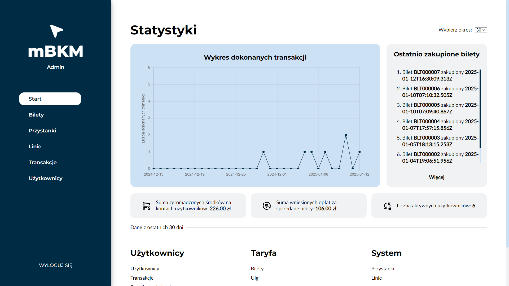
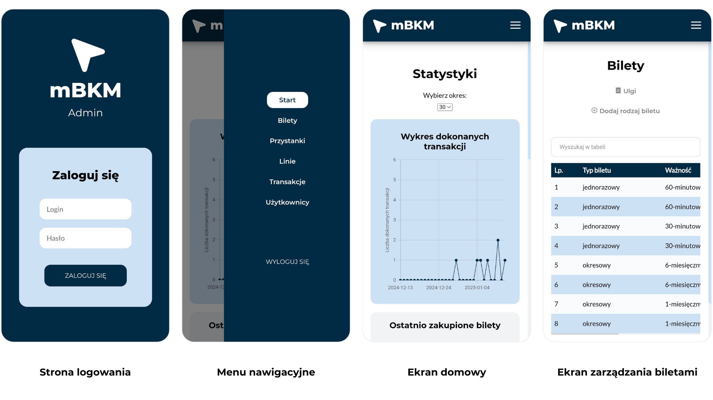

# mBKM – System sprzedaży biletów komunikacji miejskiej

System stworzony jako projekt inżynierski. Składa się z trzech głównych komponentów:

- Aplikacji mobilnej do zakupu i kasowania biletów komunikacji miejskiej (React Native),
- Aplikacji webowej dla administratora systemu (React),
- Serwera obsługującego logikę biznesową i komunikację poprzez REST API (Express.js, MongoDB).

Celem projektu było stworzenie nowoczesnego systemu biletowego, który wykorzystuje lokalizację GPS użytkownika do kasowania biletów jednorazowych. Dzięki temu możliwy jest wcześniejszy zakup biletu bez konieczności jego natychmiastowego skasowania.

## 📅 Funkcjonalności systemu

### Aplikacja mobilna (użytkownik):

- Rejestracja, logowanie, odzyskiwanie hasła,
- Zarządzanie danymi konta (adres, hasło),
- Zakup biletów jednorazowych i okresowych,
- Kasowanie biletu jednorazowego tylko w strefach przystankowych,
- Podgląd aktywnych i nieaktywnych biletów,
- Historia transakcji z danymi szczegółowymi.

#### Widok główny:



#### Widok transakcji:



#### Zakup biletu:





### Aplikacja webowa (administrator):

- Logowanie,
- Konfiguracja taryfy przewozowej (typy biletów, ceny, ulgi, daty ważności),
- Zarządzanie siatką połączeń (linie i przystanki),
- Podgląd statystyk,
- Zarządzanie użytkownikami,
- Przegląd i filtrowanie transakcji.

#### Panel główny:



#### Tabele danych:


Aplikacja webowa jest w pełni responsywna i dostosowana do urządzeń mobilnych.

#### Widok mobilny



## ⚙️ Technologie

- React Native
- React
- Express.js
- MongoDB (Atlas)
- REST API
- JWT (uwierzytelnianie)

## ⚡ Uruchomienie projektu (tryb deweloperski)

### Wymagania:

- Node.js
- Baza danych MongoDB (lokalnie lub np. MongoDB Atlas)

### 1. Aplikacja mobilna:
```
cd mBKM
npm install
npm start
```
Plik `variables.tsx`: wpisz adres IP serwera.

### 2. Aplikacja webowa (administrator):
```
cd web-app
npm install
npm start
```
Plik `.env`: wpisz adres IP serwera.

### 3. Serwer API:
```
cd server
npm install
npm start
```
#### Wymagana konfiguracja:

**plik `.env`:**
- `PORT` – port serwera

**plik `.env.local`:**
- `MONGO_URI` – adres bazy danych,
- `JWT_SECRET` – tajny klucz JWT,

### 4. Dokumentacja API:

Otwórz plik `server/doc/web/documentation.html` w przeglądarce, aby zapoznać się z dokumentacją dostępnych endpointów i przykładowymi danymi wejściowymi / wyjściowymi.

## 🌐 Struktura projektu
```
mBKM/
├── mBKM/               # Aplikacja mobilna (React Native)
├── server/             # Backend + API (Node.js, Express)
    ├── doc/            # Dokumentacja API         
├── web-app/            # Aplikacja administratora (React)
└── README.md
```
## 🚀 Pomysły na rozwój

- Podpięcie systemu płatności,
- System kontroli bileów - skanowanie QR kodów dla kontroli biletów,
- Notyfikacje push z propozycjami zakupu przebywając w strefie kasowania biletu,
- Wersja offline
- Dashboard użytkownika w wersji webowej.

## Czytaj więcej

Aby dowiedzieć się więcej o React Native, React czy MongoDB, zapoznaj się z następującymi zasobami:

- [React Native Website](https://reactnative.dev) - dowiedz się więcej o React Native.
- [React](https://react.dev/) - dowiedz się więcej o React
- [MongoDB](https://www.mongodb.com/) - dowiedz się więcej o MongoDB
- [Blog React Native](https://reactnative.dev/blog) - przeczytaj najnowsze wpisu na **blogu** React Native
- [Blog React] - przeczytaj najnowsze wpisu na **blogu** React
